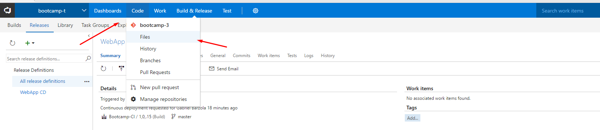
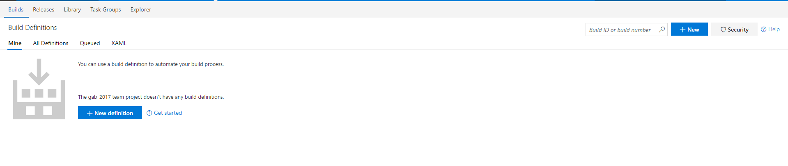
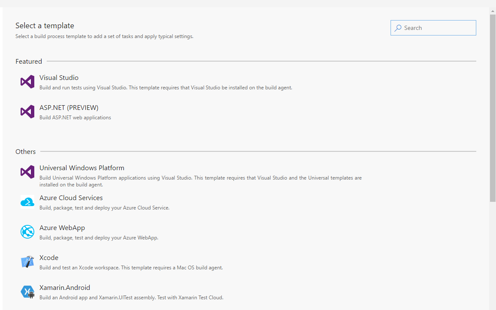
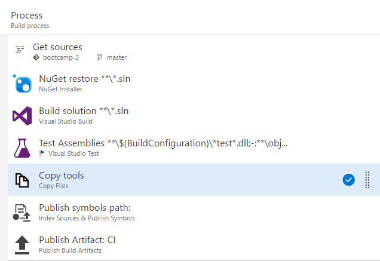

# Global Azure Bootcamp 2017
## Build and Release the Azure way

En el siguiente lab vamos realizar el build de una web api y deployearlo en azure en los entornos de Dev, QA y Prod.

Se utiliza azure como ejemplo pero el deployment se puede realizar en cualquier plataforma. Aws, Google, Onpremises, ios y Android.

## Requisitos
Una cuenta de [vsts](https://www.visualstudio.com/es/team-services/). El servicio es gratuito para 5 developers e ilimitados Stakeholders.
Una cuenta de Azure para deploy de Azure Web App. Se puede usar el [Azure Pass](https://www.microsoftazurepass.com/howto) del evento.

## Paso 1
Clonar el repositorio
1. Ingresar la url de Github https://github.com/barchito/gab-2017
2. Aceptar los cambios.
3. Esperar mientras hace el clone

## Paso 2
Revisar que los archivos esten cargados.

## Paso 3
Crear el build.

### Configuraciones especiales de las tareas

Build solution

/p:DeployOnBuild=true /p:WebPublishMethod=Package /p:PackageAsSingleFile=true /p:SkipInvalidConfigurations=true /p:PackageLocation=$(build.stagingDirectory)

Copy Tools
$(build.sourcesDirectory)\ResourceGroup\
*.json

## Paso 4 - Crear Release

### Instalar ARM Output
Vamos a utilizar una herramienta del marketplace para poder acceder las variables output del Resource Manager.
[ARM Output](https://marketplace.visualstudio.com/items?itemName=keesschollaart.arm-outputs)

## parametros del Resource Group
-hostingPlanName $(Plan) -environment $(Environment) -sqldatabasename $(sqldatabasename) -sqlAdministratorLoginPassword $(sqlAdministratorLoginPassword) -sqlAdministratorLogin $(sqlAdministratorLogin) -prefix $(prefix)

